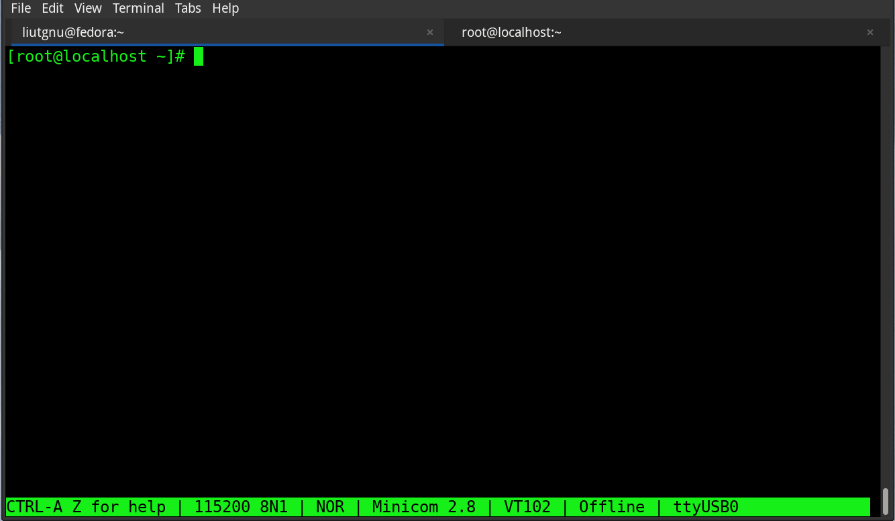

# Overview #

## News

1) Tested can work on 6.12.52-android16-6-maybe-dirty-4k kernel within
   cutterfish VM. Android physical machine not tested.

## Introduction ##

Usually we want to hack a kernel function, 

1) to insert customized code before or after a certain kernel function been called, or 

2) to totally replace a function with new one. 

How can we manage that? Well it's time to bring inline hook technique to kernel space. By replacing the first few instructions of a specific function to conditionless jump, and store the original instructions to a trampoline function, we can customizing the functions calling, and do whatever we want do in the hook function. Isn't is exciting?

## Usage ##

#### Dev #####

There will be 2 kernel modules:

1) linux/src/: The hook framework itself. In normal cases, you needn't modify its code, unless you are trying to fix bug, because we want to keep it as simple and independent to any customization. After compile, you will get hookFrame.ko.

2) linux/sample/: The customized hook/replacement functions. Write your code here, and you can take hook_vfs_read.c, replace_vfs_open.c as reference when writing your own function. Also in module.c, you can  get a general view of how to register your function to hook framework. After compile, hookFrameTest.ko will be generated.

Sometimes you will find the vermagic of hookFrame.ko and hookFrameTest.ko different from your target kernel. You can pass the target kernel's vermagic string to make:

```
# For example:
$ sudo apt-get install bbe      # install bbe to modify vermagic string within .ko
$ make arm64 KDIR=/opt/linux-4.14.98 CROSS_COMPILE=aarch64-linux-android- vermagic="4.14.98 SMP preempt mod_unload modversions aarch64"
```

#### Runtime #####
Insert hookFrame.ko first, then insert hookFrameTest.ko. If success, you can see list of currently reading files, and strings as "in replaced vfs_open", which indicating the original kernel vfs_open and vfs_read has been hooked.

you can rmmod hookFrameTest.ko, to restore the original state. Also you can find a file: /proc/hook_targets. When cat the file, you can view the currently hooked functions list, and it's status(0 disabled, 1 enabled). You can also call the following command to change hook targets status:

```
$ echo "vfs_read 0" > /proc/hook_targets # disable vfs_read hooking
$ echo "vfs_read 1" > /proc/hook_targets # enable vfs_read hooking
```

## Usecase ##
This hook framework can help kernel developers to modify a specific function on
live(a simplified livepatch ^_^), so we can insert our customized code to it as a
quick experiment. This is extremely useful when we don't want to spend a few hours
of new kernel source compiling.

E.g, a quick way to change:

```
int target_function(const struct path *path, struct file *file)
{
	file->f_path = *path;
	return dependent_func_1(file, dependent_func_2(path->dentry), NULL);
}
```

into:

```
int target_function(const struct path *path, struct file *file)
{
	printk(KERN_ALERT"%lx %lx", (unsigned long)path, (unsigned long)file);
	file->f_path = *path;
	return dependent_func_1(file, dependent_func_2(path->dentry), NULL);
}
```

However using the hook framework is not as easy, it can be frustrating to identify
and copy a lot of function dependencies. E.g, in order to make new target_function
work in the hook framework, it may look like this, assuming dependent_func_1 and
dependent_func_2 are not exported by EXPORT_SYMBOL() and friends, and can be found
in "/proc/kallsyms":

```
struct inode *(*dependent_func_2_ptr)
	(const struct dentry *upper) = find_func("dependent_func_2");

int (*dependent_func_1_ptr)(
	struct file *f,
	struct inode *inode,
	int (*open)(struct inode *, struct file *)) = find_func("dependent_func_1");

HOOK_FUNC_TEMPLATE(target_function);
int hook_target_function(const struct path *path, struct file *file)
{
	printk(KERN_ALERT"%lx %lx", (unsigned long)path, (unsigned long)file);
	file->f_path = *path;
	return dependent_func_1_ptr(file, dependent_func_2_ptr(path->dentry), NULL);
}
```

In order to make hook_target_function work, all dependent functions need to be
changed and imported. If target_function have more dependent funcions, the recursive
work can be tough and boring. To make the work easier, we now can use it this way,
target_function is left unchanged, and less dependent functions will be copied into:

```
extern struct inode *dependent_func_2(const struct dentry *upper);

extern int dependent_func_1(
	struct file *f,
	struct inode *inode,
	int (*open)(struct inode *, struct file *));

HOOK_FUNC_TEMPLATE(target_function);
int hook_target_function(const struct path *path, struct file *file)
{
	printk(KERN_ALERT"%lx %lx", (unsigned long)path, (unsigned long)file);
	file->f_path = *path;
	return dependent_func_1(file, dependent_func_2(path->dentry), NULL);
}
```

That's because the symbol resolve function is hacked(see src/framework/
symbol_resolver.c). Previously only the EXPORT_SYMBOL symbols can be resolved in
kernel modules, now all kallsyms symbols can be resolved. You can use kallsyms
symbols just like EXPORT_SYMBOL symbols in hookFrameTest ko.

## Limits ##
I have tested the code in fedora38(arm64 and x86_64). Since there is no redhat
option in 32bit, so 32bit is not tested. In addition, please check if there is
"simplify_symbols" in /proc/kallsyms. If yes, then the code can be built and
run directly. If no, please pass HAS_NO_SIMPLIFY_SYMBOLS=1 to make when built:

```
make <TARGET> HAS_NO_SIMPLIFY_SYMBOLS=1 <KDIR=> ...
```

Currently it support arm32, arm64, x86 and x86_64.

In addition, in order to make hook framework work properly, target kernel's configuration CONFIG_KALLSYMS and CONFIG_KPROBES is a must.

## Bugs ##
Please report any bugs to me: liutgnu@gmail.com, also any contributions are welcomed. Happy hacking!!!

## Demo for Linux ##


## Demo for Android ##
https://github.com/user-attachments/assets/d7c4dda6-f143-4786-a296-a0e27c61a8be

## Coffee ##

A cup of coffee can make me code faster.

<table>
  <tr>
    <td></td>
    <td><a href="https://paypal.me/liutgnu"><p align="center">Coffee me on PayPal</p></a></td>
  </tr>
</table>
